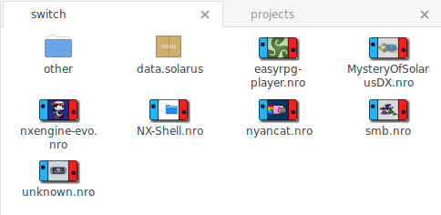

# nro-thumbnailer

Generates thumbnails from Nintendo Switch (homebrew) executables for view in
your Linux file manager (Nautilus/Nemo/Caja/...)

## Screenshots

[](assets/)

This uses the border image, which is disabled by default. Click on the image to see additional ones.

## Prequisites

 * `freeimage` from http://freeimage.sourceforge.net/ (image conversion and resizing)
 * `shared-mime-info` from https://freedesktop.org/wiki/Software/shared-mime-info/ (to add the needed mime type)

## Installation

	$ cmake . [-DCMAKE_BUILD_TYPE=Release -DCMAKE_INSTALL_PREFIX=/usr]
	$ make install

Packagers may want to use the `$DESTDIR` variable and need to call
`update-mime-database` after installation.

## Usage

```
nro-thumbnailer [OPTIONS]

Options:
  -h,--help                   Print this help message and exit
  --config FILE=~/.config/nro-thumbnailer.conf
                              Configuration file

Files:
  -i,--input FILE             Input file
  -o,--output FILE            Output file

Configuration:
  -s,--size UINT=128          Thumbnail image height
  -b,--border                 Add border around thumbnail
  -m,--max-skip UINT=10       Maximum executable size (in MB)
```

GNOME/GTK3 integration will be installed by default, so file managers should
start creating thumbnails after restarting them.
However, you may need to enable thumbnail generation itself first. Check your
file manager settings and manual for additional information.

## Configuration

You can create `$XDG_CONFIG_HOME/nro-thumbnailer.conf` (usually
`$HOMR/.config/nro-thumbnailer.conf`) and define default options there:

```ini
size=200
border=true
max-skip=25
```

## Author

carstene1ns

## License

ISC, see [LICENSE.md](LICENSE.md).
